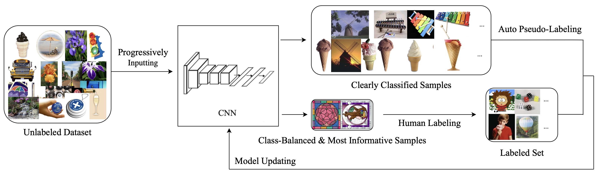

# BBAL
Pytorch implementation of BalanceBoost Active Learning.

# Difference from the original paper

1. We add class-balanced related criteria to encourage the model to select more class-balanced sample.
2. We add more class-related metrics to evaluation the performance of each classes.
3. Can specific training epoch more easily.
4. The dataset is downloaded automatically.

# How to use  the code
1. Install conda environment `conda env create -f environment.yml`
2. Download [Caltech256](https://www.kaggle.com/jessicali9530/caltech256) using `python utils/download.py`.
3. Run scripts `divide_data.sh` to divide data into test and train
4. main_program `run/bbal.py`

# References:
Some code is modified from this [repo](https://github.com/dhaalves/CEAL_keras/blob/master/CEAL_keras.py) 
